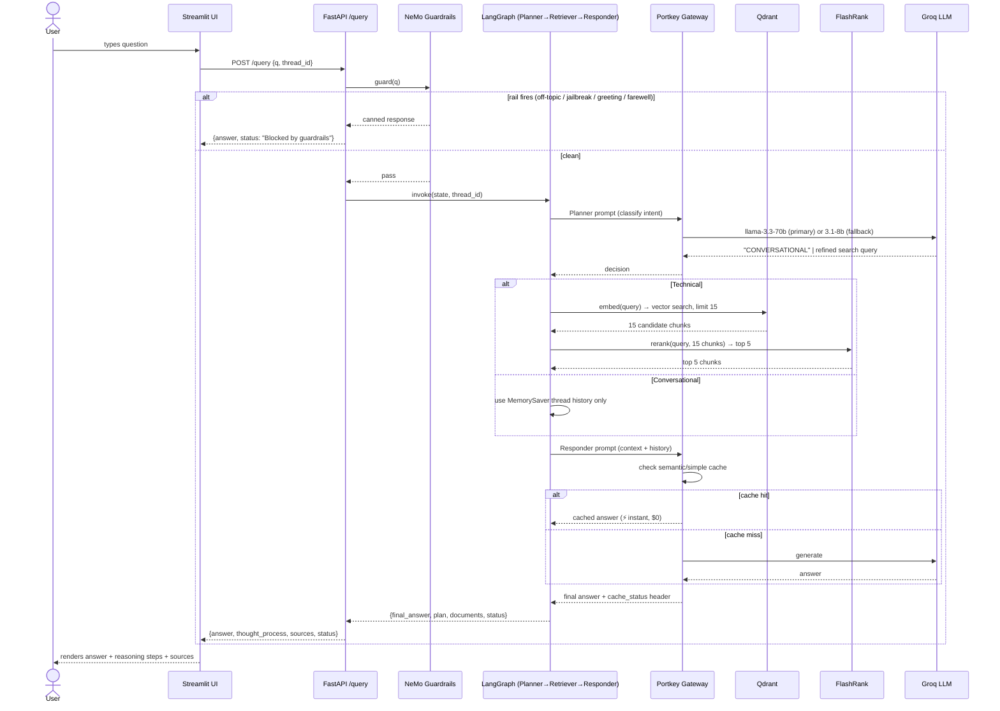
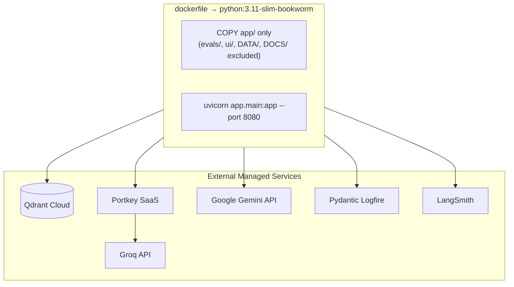

# 12 — Project Status, Architecture & Roadmap

**Snapshot date:** 2026-08-02
**Branch:** `main` (2 commits: `faa9649`, `6d223a1`) — plus an uncommitted in-progress refactor described in [§4](#4-working-tree-state--active-defects-uncommitted).

This document is the single "zoom out" reference for the project: what exists today, how it fits together end-to-end, what is currently broken, and what remains to be built. It complements — not replaces — the per-topic guides already in `DOCS/01`–`11`.

---

## 1. Executive Summary

The **Enterprise Agentic RAG** system is a LangGraph-orchestrated Retrieval-Augmented Generation service that answers enterprise IT questions (Kubernetes, Intel hardware, networking) while distinguishing conversational chit-chat from technical queries requiring retrieval. It is built as three deployable surfaces:

| Surface              | Entry point                  | Status                                                              |
| -------------------- | ---------------------------- | ------------------------------------------------------------------- |
| **API**        | `app/main.py` (FastAPI)    | Functional, but currently broken by an in-flight refactor (see §4) |
| **Chat UI**    | `ui/app.py` (Streamlit)    | Functional, talks to the API over HTTP                              |
| **Eval Suite** | `evals/app.py` (Streamlit) | Functional, drives the API and scores it with RAGAS                 |

The core intelligence loop (Planner → Retriever → Responder) is implemented, guardrails are wired in front of it, an LLM gateway (Portkey) sits between the app and Groq, and a 6-metric RAGAS evaluation harness exists. The system has reached a working "v0" end-to-end, and is now mid-refactor on its retrieval module (folder rename `retrival` → `retrieval`) — that refactor is incomplete and has left the retrieval path non-functional on disk right now.

---

## 2. End-to-End Architecture

### 2.1 Component Architecture

```mermaid
graph TB
    subgraph Client Layer
        UI[Streamlit Chat UI<br/>ui/app.py]
        EvalUI[Streamlit Eval Suite<br/>evals/app.py]
    end

    subgraph API Layer — FastAPI
        Main[app/main.py<br/>POST /query · GET /graph]
    end

    subgraph Safety Gate
        Guard[NeMo Guardrails<br/>app/guardrails/rails.py<br/>Colang intents: off-topic, jailbreak,<br/>greeting, capabilities, farewell]
    end

    subgraph Agent Brain — LangGraph StateGraph
        Planner[Planner Node<br/>intent classification]
        Retriever[Retriever Node<br/>search + rerank]
        Responder[Responder Node<br/>synthesis]
        Memory[(MemorySaver<br/>per-thread_id checkpoint)]
    end

    subgraph LLM Gateway
        Portkey[Portkey Gateway<br/>app/gateway/client.py<br/>fallback + cache + retry]
    end

    subgraph Retrieval Services
        Embed[Embedding Service<br/>Gemini gemini-embedding-2-preview 3072d<br/>→ sentence-transformers 768d fallback]
        Qdrant[(Qdrant Cloud<br/>collection: enterprise_rag)]
        FlashRank[FlashRank Reranker<br/>ms-marco-MiniLM-L-6-v2 ONNX, local CPU]
    end

    subgraph Ingestion Pipeline — offline batch job
        Loaders[Loaders<br/>pdf.py · html.py · text.py · office.py]
        Chunker[Chunker<br/>splitter.py — 1500 char paragraphs]
        Processor[processor.py<br/>orchestrates parse→chunk→embed→upsert]
    end

    subgraph Observability
        Logfire[Pydantic Logfire<br/>nested spans, every node]
        LangSmith[LangSmith<br/>LangGraph trace + token usage]
    end

    subgraph LLM Provider
        Groq[Groq<br/>llama-3.3-70b-versatile primary<br/>llama-3.1-8b-instant fallback]
    end

    UI -->|HTTP POST /query| Main
    EvalUI -->|HTTP POST /query, per golden sample| Main
    Main --> Guard
    Guard -->|blocked| Main
    Guard -->|passed| Planner
    Planner -->|CONVERSATIONAL| Responder
    Planner -->|technical query| Retriever
    Retriever --> Embed --> Qdrant
    Retriever --> FlashRank
    Retriever --> Responder
    Responder <--> Memory
    Planner -.LLM call.-> Portkey
    Responder -.LLM call.-> Portkey
    Guard -.LLM call, direct, bypasses gateway.-> Groq
    Portkey --> Groq

    DATA[/DATA/ true_data · noisy_data/] --> Loaders --> Chunker --> Processor
    Processor -->|embed| Embed
    Processor -->|upsert vectors| Qdrant
    Processor -->|save JSON| ProcessedData[(processed_data/)]

    Main -.traces.-> Logfire
    Planner -.traces.-> Logfire
    Retriever -.traces.-> Logfire
    Responder -.traces.-> Logfire
    Processor -.traces.-> Logfire
    Planner -.traces.-> LangSmith
    Retriever -.traces.-> LangSmith
    Responder -.traces.-> LangSmith
```

**Notable asymmetry:** the Guardrails gate (`initialize_rails`) builds its own `ChatGroq` client directly with `GROQ_API_KEY` — it does **not** go through the Portkey gateway. Only the Planner and Responder nodes are gateway-routed. This is a deliberate v0 simplification (guardrails needs to be cheap/fast and independent of the main pipeline's fallback config) but means gateway-level observability, caching, and fallback do not cover the safety gate itself — worth revisiting (see §6).

### 2.2 Runtime Sequence — A Single Query



### 2.3 Ingestion Pipeline (offline)

```mermaid
flowchart LR
    A[DATA/<true_data|noisy_data>/*.pdf,.html,.txt,.docx,.pptx] --> B{Extension router}
    B -->|.pdf| C1[pypdf → pdfplumber fallback\nfor image-heavy pages]
    B -->|.html/.htm| C2[BeautifulSoup\nstrip script/style, extract text]
    B -->|.txt| C3[raw read]
    B -->|.docx/.pptx| C4[Unstructured partition]
    C1 & C2 & C3 & C4 --> D[Paragraph Chunker\n≤1500 chars/chunk]
    D --> E[Save chunks JSON\nprocessed_data/<source_type>/<file>.json]
    D --> F[Embed in batches of 50\nGemini gemini-embedding-2-preview\nor sentence-transformers fallback]
    F --> G[Qdrant upsert\ncollection=enterprise_rag\nCOSINE distance]
    style G fill:#5cb85c,color:#fff
```

Entry point: `python -m app.ingestion.processor DATA --wipe` (drops + recreates the collection; omit `--wipe` to append). Sub-folder name determines `source_type` metadata (`true` / `noisy` / arbitrary).

### 2.4 Deployment View



The Docker image only ships `app/` — UI and eval suite are meant to run as separate processes/containers pointed at `BACKEND_URL`. **Gap:** `dockerfile` references `requirements-prod.txt`, which does not currently exist in the repo (only `requirements.txt`) — the Docker build is broken until that file is added (see §6).

---

## 3. Work Completed To Date

### 3.1 Agent Intelligence (`app/agents/`)

- `AgentState` TypedDict with additive `messages` reducer, `documents`, `plan` (running trace of decisions), `status`, `final_answer`.
- **Planner node**: single LLM call classifies each turn as `CONVERSATIONAL` (answerable from history/greeting) or a refined technical search query, using full conversation history as context.
- **Retriever node**: Qdrant vector search (top 15) → FlashRank cross-encoder rerank (top 5).
- **Responder node**: two prompt modes (conversational vs. grounded-in-context), calls Portkey's native client directly (not the LangChain wrapper) specifically to read the `x-portkey-cache-status` response header and surface cache hits in the UI/eval trail.
- **Graph**: linear conditional graph (`planner` → `retriever`|`responder` → `responder` → `END`) compiled with `MemorySaver` keyed by `thread_id`, giving per-conversation memory without an external store.

### 3.2 Guardrails (`app/guardrails/`)

- NeMo Guardrails (`LLMRails`) initialized once at FastAPI startup with a dedicated fast model (`llama-3.1-8b-instant`), separate from the main reasoning model.
- Colang-defined rails: off-topic refusal, jailbreak refusal, greeting, capabilities explanation, farewell — each with a distinctive canned response.
- Rail firing is detected in application code by substring-matching known canned-response fragments (`RAIL_INDICATORS`) against the rails' output, rather than relying on a structured "blocked" flag from NeMo.
- Runs *before* the LangGraph pipeline entirely — a blocked query never touches retrieval or the main reasoning LLM.

### 3.3 LLM Gateway (`app/gateway/`)

- Portkey wraps all Planner/Responder LLM calls with: fallback strategy (`llama-3.3-70b` → `llama-3.1-8b` on 429/503), semantic/simple caching, 2 retry attempts, and per-feature metadata tagging for dashboard analytics.
- Two client shapes provided: a native `Portkey` client (used where response headers must be inspected) and a LangChain-`ChatOpenAI`-compatible factory (used where `.invoke()` interface parity is needed) — both pointed at the same `GATEWAY_CONFIG`.
- Fallback routing uses two separate Groq API keys registered as Portkey "slugs" (`rag`, `brag`) rather than two hardcoded keys in code.

### 3.4 Retrieval Services (`app/services/retrieval/`)

- **Embeddings**: Gemini `gemini-embedding-2-preview` (3072-dim) as primary, with an automatic probe-and-fallback to a local `sentence-transformers` model (768-dim) if Gemini is unreachable — including exponential-backoff retry on Gemini rate limits. Batches of 50 for ingestion-time throughput.
- **Vector search**: thin Qdrant Cloud client wrapper (`search_enterprise_knowledge`).
- **Reranking**: FlashRank local cross-encoder reranker, lazily loaded, intended to fail open (fall back to raw Qdrant ordering) rather than error the whole request — documented in `DOCS/07_FLASHRANK_RERANKING.md` (implementation currently missing on disk, see §4).

### 3.5 Ingestion (`app/ingestion/`)

- Local, no-external-OCR document loaders for PDF (pypdf + pdfplumber fallback for image-heavy pages), HTML (BeautifulSoup), plain text, and Office formats (docx/pptx via `unstructured`).
- Paragraph-based chunker with a 1500-character ceiling per chunk.
- `processor.py` orchestrates the full parse → chunk → save-locally → embed → upsert flow, auto-classifies `source_type` from folder name (`true_data` → `true`, `noisy_data` → `noisy`), and supports both a single flat directory and a directory-of-subdirectories layout.
- Local JSON mirror of every processed document written to `processed_data/<source_type>/<file>.json` for auditability without needing to query Qdrant.

### 3.6 Observability

- **Logfire**: nested spans across ingestion, guardrails, planner, retriever (+ reranking sub-span), responder, with emoji-tagged event names for fast dashboard scanning.
- **LangSmith**: enabled globally via `LANGCHAIN_*` env vars set at config-import time, capturing LangGraph node-level traces, prompts, and token usage independent of Logfire.
- A documented, deliberate initialization order (`DOCS/06_KNOWN_GOTCHAS.md`) — Logfire must be configured before any other app import, and heavy clients (Gemini, FlashRank) are lazily constructed — to avoid Logfire's "poisoned/no-op" failure mode and slow FastAPI startup.

### 3.7 Evaluation Suite (`evals/`)

- **Phase 1 — live pipeline** (`pipeline.py`): replays a golden dataset against the running `/query` endpoint, rate-limited to stay under Groq RPM, capturing actual response/contexts/tool-called per sample.
- **Phase 2 — metrics** (`metrics.py`): 6 experiments — Faithfulness, Answer Relevancy, Context Precision, Context Recall, Answer Correctness (all RAGAS, judged by a *separate* Groq key so eval traffic never rate-limits the production key) and a custom zero-LLM-cost Tool Correctness metric (Jaccard similarity between called vs. expected tools).
- Careful TPM-budget engineering for Groq's free/on-demand tier: context truncation to 300 chars/2 chunks, batch size 1, staged cooldowns between experiments (60s+) and between sub-batches (40s).
- Streamlit demo app (`evals/app.py`) to run both phases and visualize scores.
- A parallel guardrails-specific eval (`guardrails_eval.py`) exists alongside the RAG metrics.

### 3.8 UI (`ui/`)

- Streamlit chat interface with per-session `thread_id` (memory scoping), a "reasoning steps" live status panel driven by the API's `thought_process` field, nested expandable source-chunk viewer, character-by-character answer "streaming" (client-side simulated, not true token streaming from the API), and a memory-wipe button that rotates the session id.

### 3.9 Documentation

- 11 existing topic guides in `DOCS/` covering system overview, ingestion, node intelligence, observability, env vars, known gotchas, FlashRank internals, guardrails, LLM gateway, and the eval suite (theory + pipeline) — generally thorough and diagram-rich. This document is `12`.

---

## 4. Working-Tree State & Active Defects (uncommitted)

The working tree has an **in-progress, uncommitted refactor**: the retrieval services package was renamed from the misspelled `app/services/retrival/` to the correct `app/services/retrieval/`, and inline comments were stripped from several files. `git status` shows the old `retrival/` files deleted and a new untracked `app/services/retrieval/` directory. This migration is **incomplete** and currently leaves the retrieval path broken:

| File                                          | Issue                                                                                                                                                                                                          | Impact                                                                                                                             |
| --------------------------------------------- | -------------------------------------------------------------------------------------------------------------------------------------------------------------------------------------------------------------- | ---------------------------------------------------------------------------------------------------------------------------------- |
| `app/services/retrieval/qdrant_service.py`  | Imports`from app.services.retrieval.embedding import embed_query` — module is `embeddings.py` (plural). Pre-existing typo, carried over from the old `retrival/` version, not introduced by the rename. | `ImportError` at import time — every technical query (`retrieve_node` → `search_enterprise_knowledge`) will crash.         |
| `app/services/retrieval/ranking_service.py` | File exists but is**empty** (0 bytes). The old `retrival/ranking_service.py` had a working `rerank_documents()` (FlashRank wrapper, ~34 lines) that was never copied over.                           | `retriever,.py` imports `rerank_documents` from this module — `ImportError`, so the whole retriever node is non-functional. |
| `app/ingestion/processor.py`                | Already correctly updated to import`app.services.retrieval.embeddings` (plural, fixed).                                                                                                                      | Ingestion's embedding import is fine; only the query-time path is broken.                                                          |
| `app/ingestion/loaders/text.py:12`          | `logfire.error(f"❌ Text Parse Failed: {exp}")` references an undefined name `exp` (should be `e`). Pre-existing, unrelated to this refactor.                                                            | Any`.txt` parse failure raises a secondary `NameError` masking the real exception.                                             |
| `dockerfile`                                | `COPY requirements-prod.txt .` — file does not exist in the repo.                                                                                                                                           | `docker build` fails immediately.                                                                                                |
| Repo root                                     | No`.env.example` despite README/docs describing one and instructing users to copy it.                                                                                                                        | Onboarding friction; env var contract only exists in prose (`DOCS/05`).                                                          |

**Immediate recommendation:** before anything else, restore `rerank_documents()` into `app/services/retrieval/ranking_service.py` (the old `retrival/ranking_service.py` content is recoverable via `git show HEAD:app/services/retrival/ranking_service.py`) and fix the `embedding` → `embeddings` import in `qdrant_service.py`. Until both are fixed, the API's `/query` endpoint throws on every technical question.

---

## 5. Known Architectural Gotchas (already documented, still relevant)

See `DOCS/06_KNOWN_GOTCHAS.md` in full; summarized:

1. **Logfire initialization order** — must configure before any app import that could transitively call `logfire.info/span` at module scope, or tracing silently no-ops for the rest of the process.
2. **Lazy loading of heavy clients** (Gemini embeddings, FlashRank) — avoids both slow FastAPI boot and the Logfire poisoning failure mode above.
3. **Guardrails bypass the LLM gateway** — noted as a new observation in §2.1 of this document, not yet in `06`; worth folding in.

---

## 6. Future Roadmap

### Now (blocking correctness)

- [ ] Restore `app/services/retrieval/ranking_service.py` (currently empty) with a working `rerank_documents()`.
- [ ] Fix `embedding` → `embeddings` import in `app/services/retrieval/qdrant_service.py`.
- [ ] Fix the undefined `exp` → `e` typo in `app/ingestion/loaders/text.py`.
- [ ] Add the missing `requirements-prod.txt` (or point `dockerfile` at the existing `requirements.txt`) so the Docker build succeeds.
- [ ] Commit or discard the `retrival` → `retrieval` rename cleanly — right now it's straddling two states in the working tree.
- [ ] Add a real `.env.example` matching what `DOCS/05_ENVIRONMENT_VARIABLES.md` documents.

### Next (robustness & correctness of existing features)

- [ ] Route the NeMo Guardrails LLM call through the Portkey gateway too, so the safety gate gets the same fallback/cache/observability coverage as the rest of the pipeline (or explicitly document why it's intentionally excluded).
- [ ] Replace substring-matching rail detection (`RAIL_INDICATORS`) with a structured signal from NeMo Guardrails (e.g., a dedicated flag/event) so a legitimate technical answer can never accidentally collide with a canned-response string.
- [ ] Add automated tests: none currently exist for `app/` (only `pytest-asyncio` is installed as a dependency, unused). At minimum: unit tests for the chunker, the planner's routing decision, and an integration test that boots the graph against a mocked Qdrant/Groq.
- [ ] `AgentState.documents` is typed `List[str]` but the retriever formats entries as `"CONTENT: {doc}"` strings, discarding the source/score metadata (`search_enterprise_knowledge` returns dicts with `source` and `score`) before it ever reaches the UI's "sources" panel — sources shown to the user currently carry no citation/filename, only raw text.
- [ ] Reconcile the duplicate `main.py` at repo root vs. `app/main.py` — clarify (or remove) whichever is not the real entry point.

### Later (scaling & productionizing)

- [ ] True token streaming from `/query` (SSE or WebSocket) — the UI currently simulates streaming client-side after the full answer already returned.
- [ ] Move guardrail rail definitions and prompts out of Python string constants (`colang_rule.py`) into versioned config files if the rule set is expected to grow much further.
- [ ] Introduce a persistent checkpointer (Postgres/Redis-backed) for LangGraph memory — `MemorySaver` is in-process only and conversation memory is lost on restart or across multiple API replicas.
- [ ] Add authentication/rate-limiting at the FastAPI layer — `/query` and `/graph` are currently unauthenticated.
- [ ] Expand the eval suite's golden dataset and consider CI-gating merges on a minimum RAGAS score threshold.
- [ ] Consider hybrid search (BM25 + vector) in Qdrant if "noisy data" contamination in results becomes an issue at larger corpus sizes — right now relevance separation between "true" and "noisy" collections relies entirely on embedding similarity + reranking.

---

## 7. Reference: Tech Stack

| Layer            | Technology                                                                                                      |
| ---------------- | --------------------------------------------------------------------------------------------------------------- |
| Orchestration    | LangChain + LangGraph (`StateGraph`, `MemorySaver`)                                                         |
| LLMs             | Groq —`llama-3.3-70b-versatile` (primary), `llama-3.1-8b-instant` (fallback + guardrails)                  |
| LLM Gateway      | Portkey — fallback routing, caching, retry, per-feature metadata                                               |
| Guardrails       | NeMo Guardrails (Colang flows)                                                                                  |
| Vector DB        | Qdrant Cloud (`enterprise_rag` collection, COSINE distance)                                                   |
| Reranking        | FlashRank,`ms-marco-MiniLM-L-6-v2`, ONNX, local CPU                                                           |
| Embeddings       | Gemini`gemini-embedding-2-preview` (3072-dim), sentence-transformers `all-mpnet-base-v2` (768-dim) fallback |
| Document Parsing | pypdf + pdfplumber (PDF), BeautifulSoup (HTML),`unstructured` (docx/pptx)                                     |
| Observability    | Pydantic Logfire, LangSmith                                                                                     |
| Evaluation       | RAGAS (5 metrics) + custom Tool Correctness (Jaccard)                                                           |
| API              | FastAPI                                                                                                         |
| UI               | Streamlit (chat + eval dashboard)                                                                               |
| Container        | Docker,`python:3.11-slim-bookworm`                                                                            |

---

*This document reflects a point-in-time read of the repository (working tree + last 2 commits). Re-generate after the retrieval-module refactor in §4 is completed and committed.*
